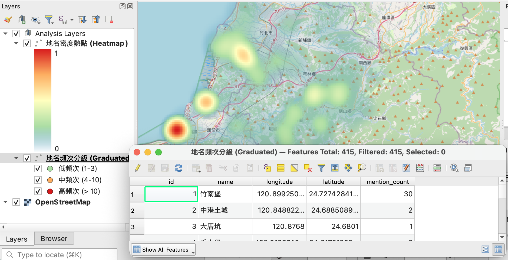

# 新竹五書歷史地名密度分析 (Hsinchu HGIS Explorer)

這是利用 `qgis-project-architect` 技能自動生成的第二個分析範例，展示了如何將史料文本中的「提及次數」轉化為空間上的「歷史重心」。

## 📂 內容物
- **`Hsinchu_Explorer.qgs`**: QGIS 專案檔（一鍵開啟）。
- **`hsinchu_data_hub.db`**: 從《新竹五書》中萃取出的地名點位與提及頻次快照。
- **`v_hsinchu_mentions_analysis.vrt`**: 定義資料庫與 GIS 幾何結構的連接檔。

## 🔍 分析亮點
1. **地名密度熱點 (Heatmap)**：以《新竹縣採訪冊》等史料中的地名提及次數為權重。您可以清楚看到中港、北埔與新竹街等「史料關注重心」。
2. **頻次分級渲染 (Graduated)**：透過三層顏色（低、中、高）區分地名的歷史地位。
3. **自動標籤**：歷史地名標記具備自動光暈 (White Buffer) 與 PingFang TC 字型適配。

## 🛠️ 技術實作 (SDM)
本專案完全由 AI Skill 根據 [Job YAML](file:///Users/wuulong/github/bmad-pa/.agent/skills/qgis-project-architect/examples/job_configs/hsinchu_mentions.yaml) 自動生成，確保了分析邏輯的透明度與可重複性。

---
*資料來源：新竹五書數據庫 | 自動化引擎：qgis-project-architect*
